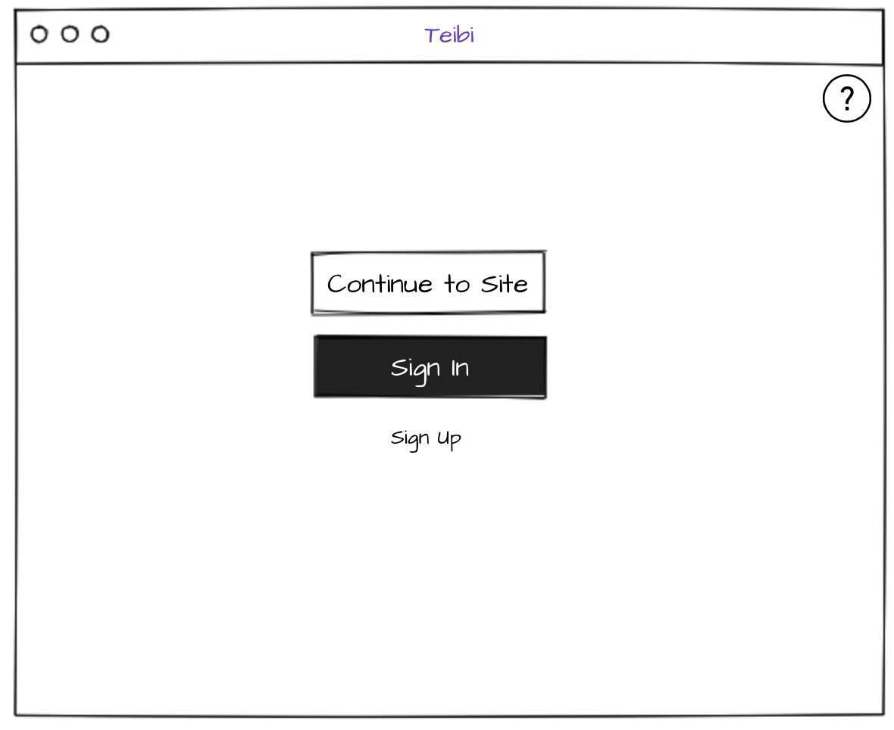
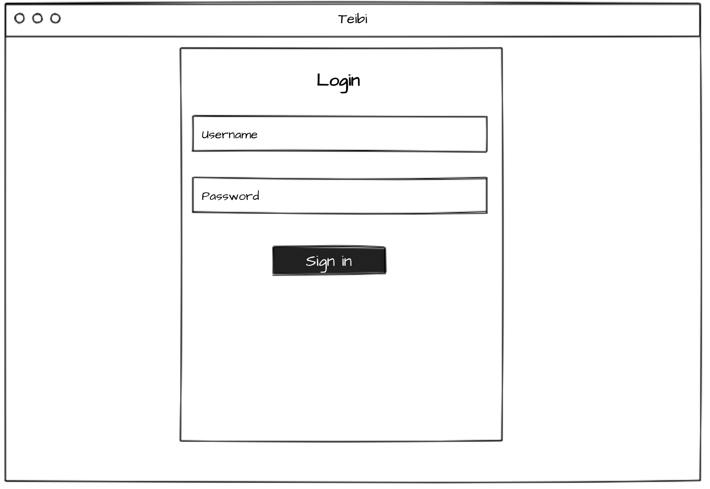
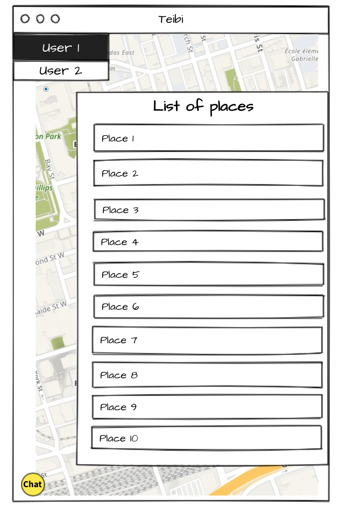

<style>
.img {width: 150px}
</style>

# Teibi: ```See you there.```

## Description:

Teibi

te ibi = see you there

## Make it work:

```npm run build```

```npm i```

```npm run install```

## WireFrame:

<p align="center">
    <br>
    Landing Page
</p>

<hr >

<p align="center">
    <br>
    Main App
</p>

<hr>

<p align="center">
    <br>
    Login
</p>

<hr>

<p align="center">
    <br>
    Signup
</p>

<hr>

<p align="center">
    
    <br>
    List
</p>

### Technology:

MERN

Dependencies:
- [axios](https://github.com/axios/axios): ^0.19.0
- [cookie-parser](https://github.com/expressjs/cookie-parser): ~1.4.4
- [debug](https://github.com/visionmedia/debug): ~2.6.9
- [dotenv](https://github.com/motdotla/dotenv): ^8.2.0
- [express](https://expressjs.com): ~4.16.1
- [if-env](https://github.com/ericclemmons/if-env): ^1.0.4
- [materialize-css](https://materializecss.com): ^1.0.0-rc.2
- [mongoose](https://mongoosejs.com): ^5.7.7
- [morgan](https://github.com/expressjs/morgan): ~1.9.1
- [react-router-dom](https://github.com/ReactTraining/react-router): ^5.1.2
- [socket.io](https://socket.io/): ^2.3.0
- [use-position]()

devDependencies:
- [concurrently](https://github.com/kimmobrunfeldt/concurrently): ^5.0.0
- [nodemon](https://github.com/remy/nodemon): ^1.19.4"


### Staff:

|Neha|Yuka|Stanley|Héctor|
|---|---|---|---|
|||||
