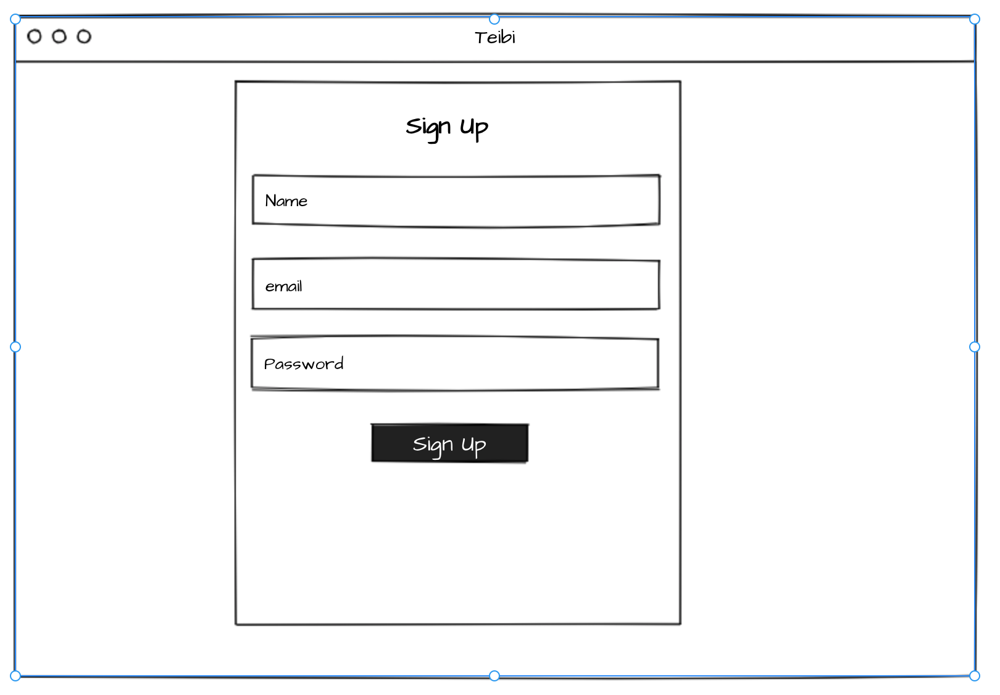

# Teibi

See you there

## Description


## Make it work

```npm run build```

```npm i```

```npm run install```

## WireFrame

Landing

App

Login

Signup

List


### Technology

MERN

Dependencies:
- axios: ^0.19.0
- cookie-parser: ~1.4.4
- debug: ~2.6.9
- dotenv: ^8.2.0
- express: ~4.16.1
- if-env: ^1.0.4
- materialize-css: ^1.0.0-rc.2
- mongoose: ^5.7.7
- morgan: ~1.9.1
- react-router-dom: ^5.1.2
- socket.io: ^2.3.0

devDependencies:
- concurrently: ^5.0.0
- nodemon: ^1.19.4"


### Staff

- Neha
- Yuka
- Stanley
- Héctor
