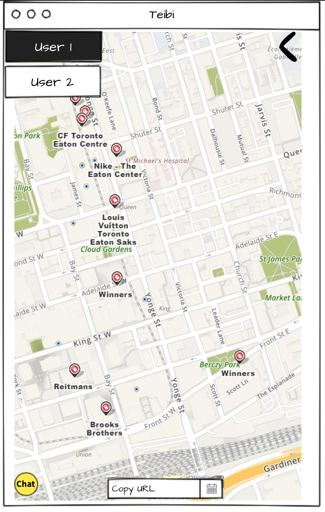

# Teibi: <q>```See you there.```</q>

We want to help people find a meeting point where they can:

- 🏖 hang out
- 🤣 laugh
- 😭 cry
- 💖 love each other
- 💔 break up
- 🏫 learn
- 🤞 try new things

**Teibi** will calculate a midpoint between users and present a list of locations to meet.

```Te ibi (latin)```

## Instructions:

- open the url
    - select begin
    - a new ID will be provided (XXXX-XXXX)
- copy url
    - use the share link
    - use the share functionality on your browser
    - copy / paste the url
- share link
- select your starting point
    - wait for other user
- once second user selects their location a mid point will be calculated
- a list of places will be presented
- pick one
- see you there
- see you next time

----
# Development
----

Work done for this application

## Make it work:

You can acces the website or install your own instance

```clone```

```npm i```

```npm run install```

```npm run build```

```npm start```

## WireFrame:

<p align="center">
    <b>Landing Page</b>
    <br>
    
</p>

---

<p align="center">
    <b>Main App</b>
    <br>
    
</p>

---

<p align="center">
    <b>Login</b>
    <br>
    
</p>

---

<p align="center">
    <b>Signup</b>
    <br>
    
</p>

---

<p align="center">
    <b>List</b>
    <br>
    
</p>

---
### Technology:

MERN

Dependencies:
- [axios](https://github.com/axios/axios): ^0.19.0
- [cookie-parser](https://github.com/expressjs/cookie-parser): ~1.4.4
- [debug](https://github.com/visionmedia/debug): ~2.6.9
- [dotenv](https://github.com/motdotla/dotenv): ^8.2.0
- [express](https://expressjs.com): ~4.16.1
- [if-env](https://github.com/ericclemmons/if-env): ^1.0.4
- [materialize-css](https://materializecss.com): ^1.0.0-rc.2
- [mongoose](https://mongoosejs.com): ^5.7.7
- [morgan](https://github.com/expressjs/morgan): ~1.9.1
- [react-router-dom](https://github.com/ReactTraining/react-router): ^5.1.2
- [socket.io](https://socket.io/): ^2.3.0
- [use-position]()
"dependencies": {
    "@material-ui/core": "^4.6.0",
    "@material-ui/icons": "^4.5.1",
    "bcryptjs": "^2.4.3",
    "cookie-parser": "~1.4.4",
    "debug": "~2.6.9",
    "dotenv": "^8.2.0",
    "express": "~4.16.1",
    "express-session": "^1.17.0",
    "if-env": "^1.0.4",
    "leaflet.locatecontrol": "^0.68.0",
    "mongoose": "^5.7.7",
    "morgan": "~1.9.1",
    "normalize.css": "^8.0.1",
    "passport": "^0.4.0",
    "passport-local": "^1.0.0",
    "react-router-dom": "^5.1.2",
    "react-toastify": "^5.4.0",
    "react-use": "^12.13.0",
    "socket.io": "^2.3.0",
    "yelp-fusion": "^3.0.0"
  },
devDependencies:
- [concurrently](https://github.com/kimmobrunfeldt/concurrently): ^5.0.0
- [nodemon](https://github.com/remy/nodemon): ^1.19.4"


  "devDependencies": {
    "concurrently": "^5.0.0",
    "eslint": "^6.6.0",
    "eslint-config-prettier": "^6.5.0",
    "eslint-plugin-prettier": "^3.1.1",
    "nodemon": "^1.19.4",
    "prettier": "^1.18.2"
  }

### Staff:

|Neha|Yuka|Stanley|Héctor|
|---|---|---|---|
|||||
